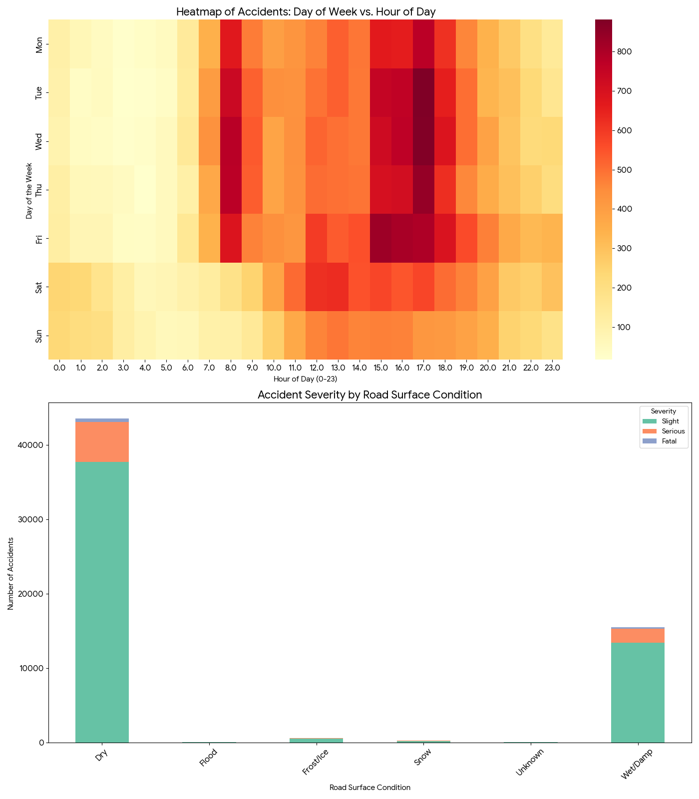
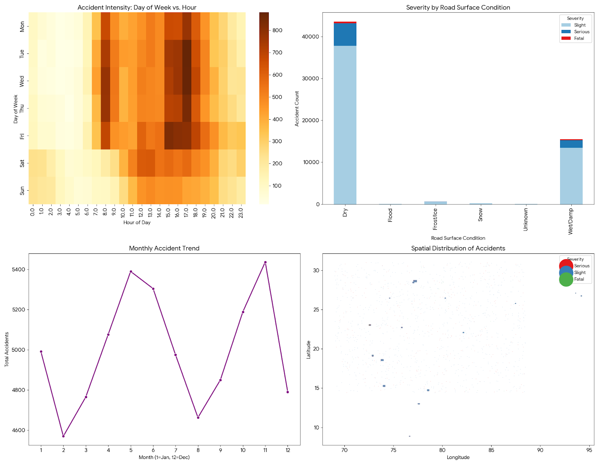
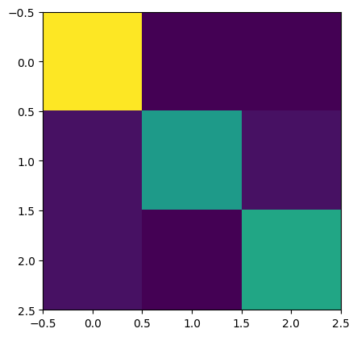

# Cracks to Craters  
AI-Based Road Damage Detection & Risk Prediction

Try it out at https://cracks-to-craters.onrender.com/

---

## Overview
Cracks to Craters is a machine learning system designed to detect and predict road damage severity based on environmental and usage factors. The goal is to move from reactive pothole fixing to proactive maintenance.

---

## Features
- Predict pothole formation risk  
- Uses structured input data (rainfall, traffic, pavement age, etc.)  
- ML-based classification model  
- FastAPI backend for real-time predictions  
- Scalable deployment (local + cloud)
- Tanya, your AI road safety advisor (powered by GPT5-NANO)

---

## Problem Statement
Road damage like potholes develops due to multiple factors:
- Traffic load
- Rainfall
- Pavement age
- Soil type

Traditional systems:
- Detect damage *after* it appears  
- Waste time and resources  

This system:
- Predicts risk *before* failure  

---

## System Architecture

```
          ┌──────────────────────┐
          │   Input Features     │
          │----------------------│
          │ Rainfall             │
          │ Traffic Volume       │
          │ Pavement Age         │
          │ Soil Type            │
          └─────────┬────────────┘
                    │
                    ▼
          ┌──────────────────────┐
          │  Feature Processing  │
          │----------------------│
          │ Encoding             │
          │ Scaling              │
          └─────────┬────────────┘
                    │
                    ▼
          ┌──────────────────────┐
          │  ML Model            │
          │----------------------│
          │ Logistic Regression  │
          └─────────┬────────────┘
                    │
                    ▼
          ┌──────────────────────────────┐
          │       Prediction Output      │
          │------------------------------│
          │ Risk Level(Low, Mediu, High) │
          └──────────────────────────────┘
```

---

## Tech Stack
- Python  
- FastAPI  
- Scikit-learn  
- Pandas  
- NumPy
- Pydantic

---

## Dataset

| Feature                | Description |
|----------------------|------------|
| avg_rainfall_mm      | Average rainfall |
| traffic_volume_vph   | Vehicles per hour |
| pavement_age_yrs     | Age of road |
| last_repair_yrs      | Years since last repair |
| soil_type            | Type of soil |

---

## Model

Logistic Multivariable Regression

---

## Graphs

  

### Confusion Matrix


---

## API Usage

### Endpoint
```
POST /predict
POST /chat
```

### Request
```json
{
  "avg_rainfall_mm": 120,
  "traffic_volume_vph": 300,
  "pavement_age_yrs": 5,
  "last_repair_yrs": 2,
  "soil_type": "clay"
}
```

### Response
```json
{
  "prediction": "medium"
}
```

---

## Installation
```bash
git clone https://github.com/fourtysevencode/cracks-to-craters.git  
cd cracks-to-craters  
pip install -r requirements.txt  
```
---

## Run
```bash
uvicorn app:app --reload  
```
---

## Authors
Ronak Pal,
Osh Singh,
Sri Katyayani Kota
